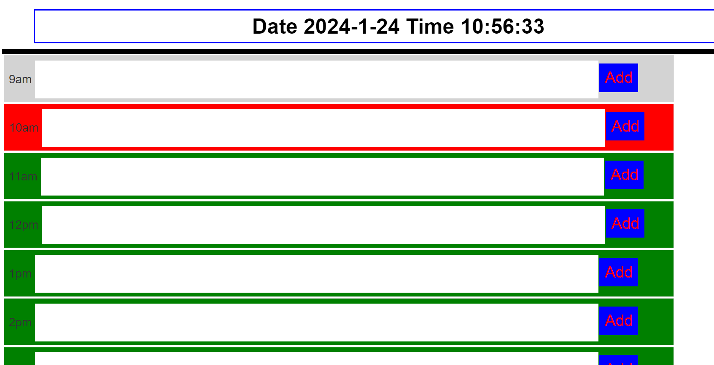

# TheCalendar

The Calendar: https://rahmatullahzadran.github.io/TheCalendar/

## How to use

The Calendar is been designed to be easy to use, grey is the colour of past hours. Red is the colour of current hours. Green is the colour of future hours.

You can input your notes and click the add button to add them to the calendar.

